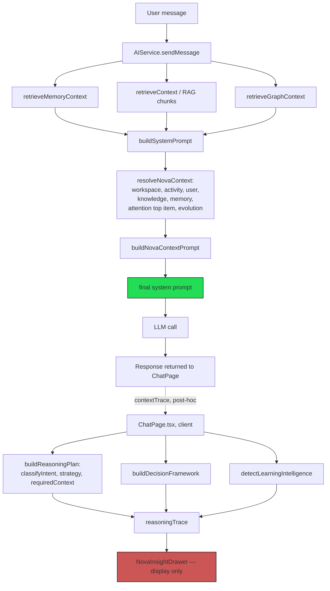
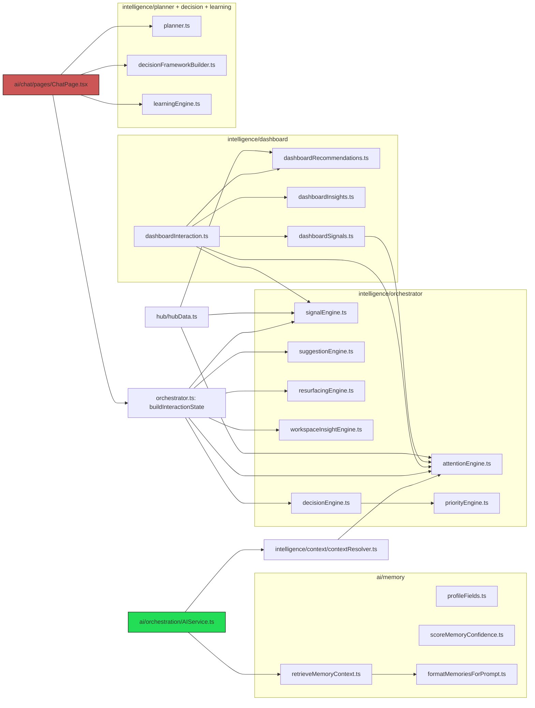

# NOVA PIP UX-14 Architecture Consolidation Sprint

**Status: consolidation audit, not a feature sprint.** No feature expansion, no speculative abstractions, no UI redesigns, no breaking schema changes, no migrations. Code changes in this sprint are limited to two zero-risk documentation corrections (§ Zero-Risk Refactors) — everything else is design, scoped and sequenced for implementation inside UX-14, not built here. Builds on `docs/ux-14-strategic-roadmap.md` and `docs/ux-14-engineering-blueprint.md`.

---

## Current Architecture

Four module trees currently implement "intelligence" concerns, plus the always-present command/action execution substrate:

- **`ai/memory/`** — memory CRUD, detection/scoring, and the `profileFields.ts` personalization convention. Read side (`retrieveMemoryContext`) is wired live into every chat turn.
- **`intelligence/`** — the largest tree: `orchestrator/` (attention, resurfacing, signals, suggestions, workspace insights — chat-turn scope), `dashboard/` (a parallel set for the Executive Dashboard/Hub — workspace-view scope), `planner/`, `intent/`, `decision/`, `strategy/`, `learning/` (UX-12's reasoning classifiers), `context/` (`contextResolver.ts` — the one path that actually reaches the LLM prompt).
- **`hub/`** — the Workspace Intelligence Hub's own composition (`hubData.ts`), which reuses several `intelligence/dashboard/` and `intelligence/orchestrator/` primitives rather than reimplementing them.
- **`evolution/`** — maturity/timeline/health/forecast reporting, consumed by both the Hub and `contextResolver.ts`'s evolution summary.

Two flows already reach real, live model behavior; a third looks like it should but doesn't:

1. **`AIService.sendMessage`** (server-of-the-UI, every chat turn): `retrieveContext` → `retrieveGraphContext` → `retrieveMemoryContext` → `buildSystemPrompt` → `resolveNovaContext` (workspace/activity/user/knowledge/memory/**top attention item**/evolution summary) → `buildNovaContextPrompt` appended → LLM call. Memory and a single prioritized attention item are real inputs to real responses today.
2. **`ChatPage.tsx`, post-turn, client-side**: `buildInteractionState` (fuller attention list, resurfaced knowledge, workspace insights, action suggestions, signals) feeds `NovaInsightDrawer` only. Never influences the response — the response has already been generated by the time this runs.
3. **`ChatPage.tsx`, post-turn, client-side, again**: `buildReasoningPlan` + `buildDecisionFramework` + `detectLearningIntelligence` → `reasoningTrace` → `NovaInsightDrawer`. Same shape as #2 — real computation, UI-only destination, computed after the response it appears to describe.

`dashboardInteraction.ts` (Executive Dashboard) and `hub/hubData.ts` (Workspace Intelligence Hub) each independently fetch and compose workspace data, but both call the **same** `generateDashboardRecommendations` — confirmed via direct read, this one is already properly shared, not duplicated.

The notification bell (`TopBar.tsx`) is a disabled UI element with no backing model, no storage, no service.

---

## Duplicate Systems

### Genuine duplication

**Two independent "what should I do next" engines**, never reconciled with each other:
- `intelligence/orchestrator/suggestionEngine.ts` (`deriveActionSuggestions`) — chat-turn scope, feeds `NovaInsightDrawer`'s action chips.
- `intelligence/dashboard/dashboardRecommendations.ts` (`generateDashboardRecommendations`) — workspace-view scope, feeds **both** the Executive Dashboard (`dashboardInteraction.ts`) and the Hub (`hub/hubData.ts`) — correctly shared between those two consumers, but structurally identical in purpose to `suggestionEngine.ts` and never unified with it.

Both wrap an existing command with a human-readable reason; both are pure, deterministic, no-AI. The duplication is in having two separate composition functions for the same underlying concern (recommend an existing action), not in the individual commands they wrap.

### Terminology collision (not data duplication)

**"Profile" means two unrelated things in this codebase**, correctly separated at the data layer but confusingly overlapping in naming:
- `profiles` table + `settings/api/profile.ts` (`getProfile`/`updateProfile`) — auth-adjacent identity: `display_name`, `default_chat_provider_id`. Nothing to do with personalization content.
- `ai_memory` rows with `source: 'profile:<field>'` + `profileFields.ts` (`ProfileFieldKey`, `profileSource`) — the actual personalization data (occupation, industry, expertise, goals, communication style, answer length, decision style).

Confirmed clean: `useProfileFields.ts` enforces update-in-place semantics for single-select fields (no duplicate rows), and multi-select fields toggle cleanly. **This is not a data problem — it's a naming problem.** A future contributor reading "update the profile" could reasonably mean either one.

### Borderline — shared primitive, separate composition

`intelligence/orchestrator/workspaceInsightEngine.ts` (`computeWorkspaceInsights` — chat-turn scope: most_active/least_active/largest_library/recent_uploads/most_queried_topic) and `intelligence/dashboard/dashboardInsights.ts` (`generateExecutiveInsights` — dashboard-view scope: knowledge/learning/organization/memory/research categories, each with required evidence) share one primitive (`mostFrequentSignificantWord`, correctly reused, not copied) but are otherwise two independently composed, differently typed (`WorkspaceInsight` vs. `ExecutiveInsight`) views of similar underlying facts. Not clearly wrong — the two surfaces genuinely want different things (a glance vs. an evidenced insight card) — but worth naming so it isn't accidentally read as full duplication or, conversely, silently extended twice.

### Coherence gap, not code duplication

`buildReasoningPlan`'s planner signals (`hasMemoryContext`/`hasGraphContext`) are derived from `contextTrace`, itself derived from the same `matches`/`graphContext`/`memoryContext` that `resolveNovaContext` — the thing that actually reaches the prompt — also derives its knowledge/memory context from. Not duplicate code, but two independent, loosely-related summaries of the same retrieval are computed for two different purposes: one narrowly shapes the real prompt (a single attention item), the other computes a much richer classification (intent, strategy, required context) that goes nowhere. See **Execution Flow** below.

### Stale documentation (found and fixed in this sprint)

Both `retrieveMemoryContext.ts` and `formatMemoriesForPrompt.ts` carried docstrings stating memory "is not called from buildSystemPrompt/AIService yet." Confirmed false by direct read of `AIService.ts:106,112` — both are live in every chat turn. Left uncorrected, either file read in isolation leads a contributor to the wrong conclusion about what's already wired. **Fixed** — see Zero-Risk Refactors.

### Confirmed NOT duplicated

Stated explicitly so no future pass "fixes" something that isn't broken:
- `attentionEngine.detectAttentionItems` + `findContradictoryMemoryPairs` — the single canonical source, reused identically by the chat orchestrator, the dashboard/Hub's `buildAttentionCenter`, and `contextResolver`'s prompt injection. The best-unified subsystem in the entire intelligence layer.
- `signalEngine.hasUnreviewedMemory` — one function, reused as-is by the dashboard.
- `generateDashboardRecommendations` — one function, properly shared by both Dashboard and Hub.
- `resurfacingEngine.resurfaceKnowledge` — single-owner (chat orchestrator only); the Hub's Recent Notes/Active Conversations sections are simpler direct list renders, a legitimate different pattern for that surface, not a second implementation of resurfacing logic.

---

## Canonical Ownership

| Concern | Canonical owner | Status |
|---|---|---|
| Personalization / preferences | `ai/memory/profileFields.ts` convention over `ai_memory` | Confirmed sole source of truth (see audit above) — no change needed |
| Attention / contradiction detection | `intelligence/orchestrator/attentionEngine.ts` + `signalEngine.ts` | Already canonical |
| Resurfacing | `intelligence/orchestrator/resurfacingEngine.ts` (chat-turn) | Already canonical for its scope; Hub's simpler lists are a different, acceptable pattern |
| Recommendations / suggestions | Split — recommend `dashboardRecommendations.ts`'s shape becomes canonical (already multi-consumer); `suggestionEngine.ts` to be reconciled | **Not yet canonical — Required Refactor** |
| Workspace insights | Split — `workspaceInsightEngine.ts` (chat) vs. `dashboardInsights.ts` (dashboard) | Acceptable as-is; reconciliation is a Future Opportunity, not required |
| Notifications | None exists | To be built per Blueprint §3, owned by a new module once it exists |
| Reasoning / intent / strategy classification | `intelligence/planner/` (`buildReasoningPlan`) | Canonical for *computing* the plan; the gap is where the output goes, not who computes it |
| Profile identity (display name, provider) | `settings/api/profile.ts` over `profiles` table | Canonical, unrelated to personalization content — naming clarity recommended, not a data change |

---

## Execution Flow

The requested `User → Memory → Planner → Intent → Decision → Prompt Builder → LLM → Response` pipeline **does not exist as one flow today.** Two separate flows exist; only one reaches the model.

**Where the planner output disappears, precisely:** `buildReasoningPlan` is invoked inside a `useMemo` in `ChatPage.tsx` (lines ~202-220), gated on `contextTrace` — which only exists **after** `AIService.sendMessage` has already returned and the LLM has already responded. Its output (`ReasoningPlan`: intent, strategy, required context, response strategy) is passed only into `buildReasoningTrace`, which is passed only to `NovaInsightDrawer`. It is never passed to `AIService.sendMessage`, never appended to any prompt, and architecturally *cannot* influence the response it's computed from, because it's computed after that response already exists.

---

## Dependency Graph

Green (`AIService.ts`) is the only node that reaches the live model prompt. Red (`ChatPage.tsx`) is where both parallel UI-only computations (`buildInteractionState`, the reasoning trace) originate. `dashboardInteraction.ts` and `hub/hubData.ts` sit off to the side, correctly sharing `dashboardRecommendations.ts` with each other but disconnected from `suggestionEngine.ts`.

---

## Required Refactors

These require real code changes and are **not performed in this sprint** — each has its own blast radius and belongs to UX-14 implementation, sequenced per the Blueprint.

**R1 — Thread `buildReasoningPlan` into `AIService.sendMessage`.** Move the plan computation from `ChatPage.tsx` into `AIService.sendMessage`, using signals derived from data already in scope there (`matches.length > 0`, `graphContext !== null`, `memoryContext !== null` — the pre-response equivalents of what `contextTrace` computes post-hoc). Extend `buildNovaContextPrompt` (or add a sibling) to render the plan into the system prompt. Return the plan in `SendMessageResult` so `ChatPage.tsx` reads it back for the trace panel instead of recomputing it. This is the smallest change identified that makes planner reasoning actually influence responses — no new AI call, no new fetch, reuses the existing rule-based classifier. **Not agent execution** — the plan still only shapes prompt text, never selects a code path. Deferred: this changes what every live chat response looks like, and per the Blueprint's own risk note needs the same staged, mocked-then-real-transcript verification this project has applied to every other `AIService` change.

**R2 — Consolidate `suggestionEngine.ts` and `dashboardRecommendations.ts`.** ~~Deferred to UX-14 implementation~~ **Done (UX-14.1).** Merged into `src/modules/intelligence/recommendations/recommendationEngine.ts` — one exported `Recommendation` type, one `generateRecommendations({ scope: 'chat' | 'dashboard', ... })` function. Each scope's rule branches are unchanged from their original files (same conditions, same reason text, same command ids); characterization tests ported from both original test suites unchanged, plus two new tests asserting scope isolation (a dashboard-only signal has no effect under `scope: 'chat'` and vice versa). All four call sites updated (`orchestrator.ts`, `dashboardInteraction.ts`, `hub/hubData.ts`, plus the two rendering/summary consumers `RecommendedActionsSection.tsx` and `executiveSummary.ts`). Verified: tsc clean, 956/956 vitest (up from 954 — net of 15 ported tests removed, 17 added), lint clean, build clean.

**R3 (optional, lower priority) — Reconcile `workspaceInsightEngine`/`dashboardInsights`.** Not required; flagged so a future phase doesn't extend both independently without noticing they're adjacent.

---

## Zero-Risk Refactors

Executed in this sprint, since they are pure documentation corrections with no behavior change and directly serve the sprint's purpose — establishing accurate ground truth about what's already wired:

- **`src/modules/ai/memory/retrieveMemoryContext.ts`** — removed the false claim "Not called from buildSystemPrompt or AIService yet"; corrected to state it's live in every chat turn.
- **`src/modules/ai/memory/formatMemoriesForPrompt.ts`** — same correction.

No other change qualified as genuinely zero-risk. Everything else identified (R1, R2, R3) touches either live prompt construction or multi-consumer suggestion logic, and gets a real verification pass rather than being folded into "trivial cleanup."

---

## Future Opportunities

Not part of UX-14, not scoped here beyond naming:
- R3 (workspace-insights reconciliation), if it recurs as a pain point.
- Background/scheduled execution infrastructure spike (Blueprint §3, increment 2) — needed for true proactive intelligence, not needed for anything in this sprint or UX-14's first increment.
- An explicit permission/confirmation model — needed before Agent Capabilities can be scoped at all (Roadmap, deferred).
- Renaming to resolve the "profile" terminology collision (e.g., referring to the `ai_memory` convention as "Personalization Fields" in code comments/UI copy, reserving "Profile" for the `profiles` table) — a naming change, not a data migration; low priority, no functional impact.

---

## Risk Assessment

| Item | Risk | Mitigation |
|---|---|---|
| R1 (planner → prompt) | Changes what every live chat response looks like; response tone/length/focus could shift in ways not caught by unit tests alone | Stage behind the same mocked-backend-then-real-transcript verification this project used for the Reliability & Truth Audit; do not ship on unit tests alone |
| R2 (suggestion engine merge) | Low technical risk (both already return the same `Command` + `reason` shape) but could silently change which suggestions appear on which surface if scope isn't preserved carefully | Write characterization tests capturing current output of both functions *before* refactoring, diff after |
| Doing nothing (leaving both R1 and R2 unaddressed) | UX-14's Proactive Intelligence and Intelligence Layer phases would each build on a still-fragmented base — any later consolidation would then need to migrate two live features simultaneously instead of refactoring pre-feature code | Sequence R2 before Proactive Intelligence persistence, R1 before/alongside Intelligence Layer work, per Implementation Order below |
| Terminology collision ("profile" x2) | Low risk technically (data is already correctly separated) but real risk of a future contributor building a competing preference store because they didn't realize `profileFields.ts` already exists | Addressed by this document; a naming pass is a Future Opportunity, not required |

---

## Migration Strategy

**No database migration in this sprint or implied by any Required Refactor above.** Every finding here is an application-code coherence issue, not a data-model issue — confirmed directly, not assumed. R1 and R2 are both refactors of existing call sites (moving a function invocation, merging two functions with an identical return shape), not schema or storage changes. "Migration" in the Implementation Order below means moving code, not moving data.

---

## Implementation Order

1. **Done (this sprint):** Zero-risk docstring corrections.
2. **Done (UX-14.1):** R2 — recommendation engines consolidated, since Blueprint §3 (Proactive Intelligence, increment 1) explicitly depended on this happening first.
3. **UX-14, next:** R1 — thread the planner into `AIService.sendMessage`, matching the Blueprint's own sequencing (Intelligence Layer, §4, fourth/last — smallest in scope but highest in live blast radius).
4. **Not UX-14:** R3 and the two future-exploration infrastructure spikes (background execution, agent permission model).

---

## Acceptance Criteria

For this Consolidation Sprint specifically (not for UX-14 features, which remain unimplemented):

- [x] `profileFields.ts` confirmed as the sole source of truth for personalization data — no competing writer found; the only ambiguity found was naming (`profiles` table vs. `ai_memory` convention), not data duplication.
- [x] All five named engines (`dashboardRecommendations`, `suggestionEngine`, `attentionEngine`, `resurfacingEngine`, `workspaceInsightEngine`) mapped to explicit ownership, with genuine duplication (recommendations) distinguished from healthy reuse (attention/resurfacing) and borderline cases (workspace insights) named rather than glossed over.
- [x] The exact point where planner output disappears identified with file/line precision (`ChatPage.tsx`'s `reasoningTrace` `useMemo`, gated on post-response `contextTrace`), and the smallest fix identified without inventing agent execution.
- [x] Root cause of discarded memory confidence confirmed: computed once at approval time by original design, never persisted — not a bug, a scoped-out phase boundary (per the Blueprint's Memory Intelligence section).
- [x] Notification architecture gap scoped to the smallest viable path (already specified in the Blueprint; not re-derived here).
- [x] Zero-risk refactors identified and executed (2); required refactors identified, sequenced, and explicitly deferred with rationale rather than silently built.
- [x] No schema, migration, or UI changes made.
- [x] `docs/ux-14-architecture-consolidation.md` produced.
